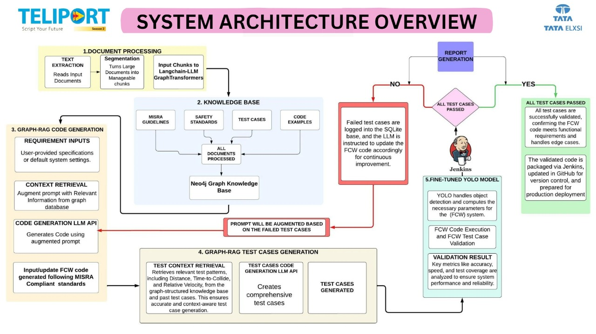

# 🚀 **NeuroFCW - Neural Network-Based FCW System**
**Author - Aryan Pandey, Priyadarshi Uttpal and Sanket Poojary**

NeuroFCW is an advanced Forward Collision Warning (FCW) system powered by Generative AI, Neural Networks, and a Graph-RAG architecture. It automates code generation, test case creation, and continuous validation for FCW systems, ensuring robustness, precision, and real-world readiness.

---

### 📊 **System Architecture**

Below is the high-level system architecture overview for **NeuroFCW**:



---

### 🧠 **Key Features**
1. **Document Segmentation and Preprocessing**  
   - Breaks down input documents into manageable segments for efficient processing.

2. **Graph-RAG Knowledge Retrieval**  
   - Stores and retrieves safety standards, MISRA guidelines, test cases, and code examples using **Neo4j Graph Knowledge Base**.

3. **Graph-RAG Code Generation**  
   - Generates FCW code compliant with MISRA standards using:
     - Contextual data retrieval
     - Code generation with a **Large Language Model (LLM) API (Llama-3.3-70b pre-trained LLM)**

4. **Graph-RAG Test Case Generation**  
   - Automatically generates comprehensive test cases with relevant test patterns.

5. **Fine-Tuned YOLO Model**  
   - Handles object detection and computes parameters for FCW validation.

6. **Validation & Continuous Improvement**  
   - Failed test cases are logged and used to improve future FCW code.

7. **Performance Logging**
   - Logs critical metrics such as detection accuracy, processing speed, and code validation success rates to ensure real-world deployment readiness.


---

### 🛠 **Tech Stack**
- **AI/ML**: YOLOv11, LangChain, OpenAI APIs
- **Databases**: Neo4j, SQLite
- **Programming Languages**: Python
- **DevOps Tools**: Jenkins, GitHub Actions, CARLA Simulation
- **Frameworks**: Large Language Models (LLMs), Graph-RAG

---

### 📂 **System Workflow**
The system operates in the following steps:
1. **Input Documents** → Segmented into manageable chunks.
2. **Knowledge Base Processing** → Neo4j Aura graph database retrieves relevant guidelines and safety standards.
3. **Code Generation** → LLM APIs generate FCW code tailored to input requirements with MISRA compliance.
4. **Test Case Generation** → Retrieves patterns and validates with YOLO.
5. **Validation** → Test results logged, and the FCW system is updated continuously
6. **Perfromance metrics** → Critical KPIs (accuracy, processing speed, and anomaly handling) are logged for analysis.

---

### ✅ **Output**
- **MISRA-Compliant FCW Code**
- **Comprehensive Test Cases**
- **Validated FCW Code Packages for Deployment**

---

### 📈 **Future Scope**

- Multi-Sensor Fusion with LiDAR, Radar, and Camera Systems
- Enhanced Fine-Tuning of LLMs for Anomaly Handling
- Reinforcement Learning for ADAS Decision-Making
- Energy-Efficient ML Models using lightweight and quantized ML models


### 🤝 **Contributors**
- Aryan Pandey
- Priyadarshi Uttpal
- Sanket Poojary

---

### 🔗 **How to Use**
1. Clone the repository:
   ```bash
   git clone https://github.com/ltd-ARYAN-pvt/NeuroFCW.git
   ```
2. Install required dependencies:
   ```bash
   pip install -r requirements.txt
   ```
3. Run the main program:
   ```bash
   python app.py
   ```

---

### 🌟 **Contact**
For more information, reach me at:  
- 📧 **aryan2002pandeythrgrt@gmail.com**  
- 📧 **sanketpoojary003@gmail.com**
- 📧 **priyadarshiutpal06@gmail.com**
---
